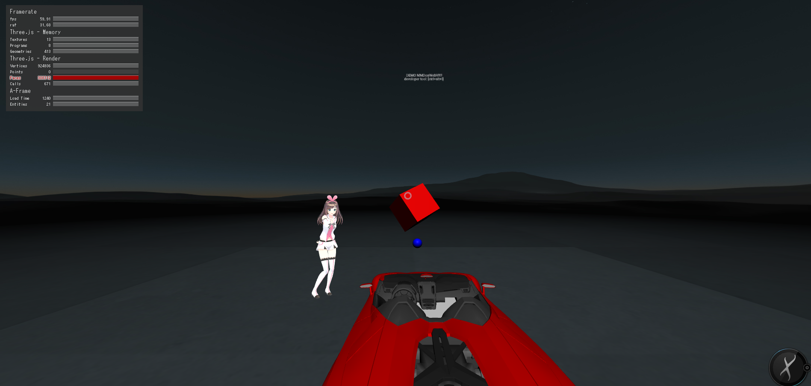

# MMDonWebVR

## Using modules
- A-Frame : https://github.com/aframevr/aframe/
- aframe-react : https://github.com/ngokevin/aframe-react
- A-Frame MMD component : https://github.com/takahirox/a-mmd
- Physics for A-Frame VR : https://github.com/donmccurdy/aframe-physics-system

## Using pmx
- Kizuna AI : http://kizunaai.com/terms/
- 3D model : https://free3d.com/

## Screenshot

   
  <a href=""><strong>Takenoko Tech.</strong></a>

